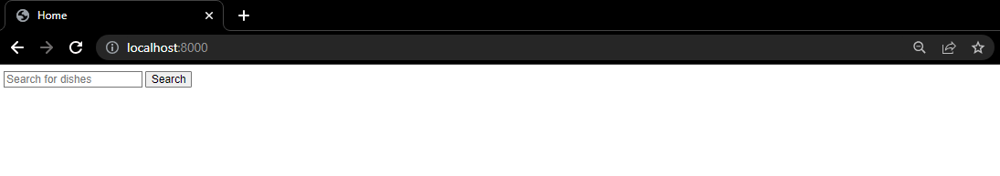
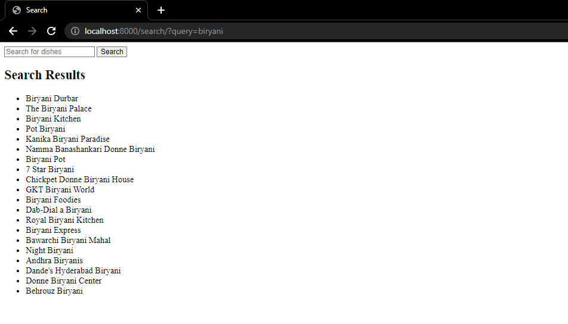

# Django PNSearch Application

## Installation

1. Clone the repository
2. Navigate to the project directory
3. Install the required dependencies: `pip install -r requirements.txt`
4. Run the database migration: `python manage.py migrate`

## Usage

1. Start the development server: `python manage.py runserver`
2. Access the application in your web browser at `http://localhost:8000`.
3. On the home page, enter your desired dish in the search field and click the "Search" button.
4. You will be redirected to the search results page, displaying the best match for your query.

## Screenshots

 